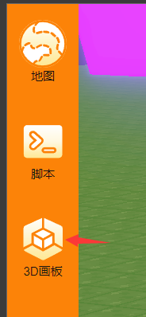
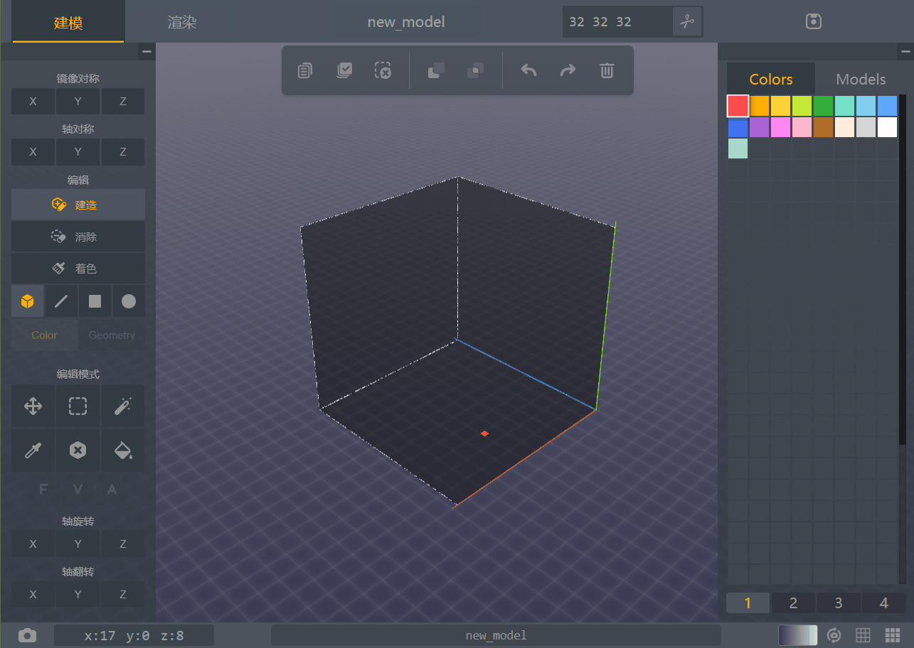

# LightDotCutter 实例教程

此实例将教你如何从零开始做一个简单的 PVE（玩家对抗敌人）游戏。

本游戏中我们将使用会发光的彩色方块来代替敌人，用圆点来代替分数奖励，创造一个简单的、完整的、可扩展的 PVE 游戏。

## 准备工作

首先创建一个新的地图，尺寸选择 大 或者 超大 都没问题（毕竟不会用到太多空间）。

进入地图后，点击左上角的箭头，打开模型编辑器

将模型大小设为 10x10x10（或者 16x16x16，但不宜太大或太小），然后选择白色，将整个区域涂满，最后将模型名称改为`enemy`，保存到地图。

至此，准备工作已全部完成，下一节我们将设置敌人的生成。

??? question "为什么需要这个白色模型"

    因为敌人在此游戏中是彩色光点，因此这个白色的模型是基础模型，通过改变其<property>meshColor</property>属性可使其改变颜色，
    然后通过改变<property>meshEmissive</property>使其发光。
