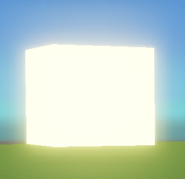
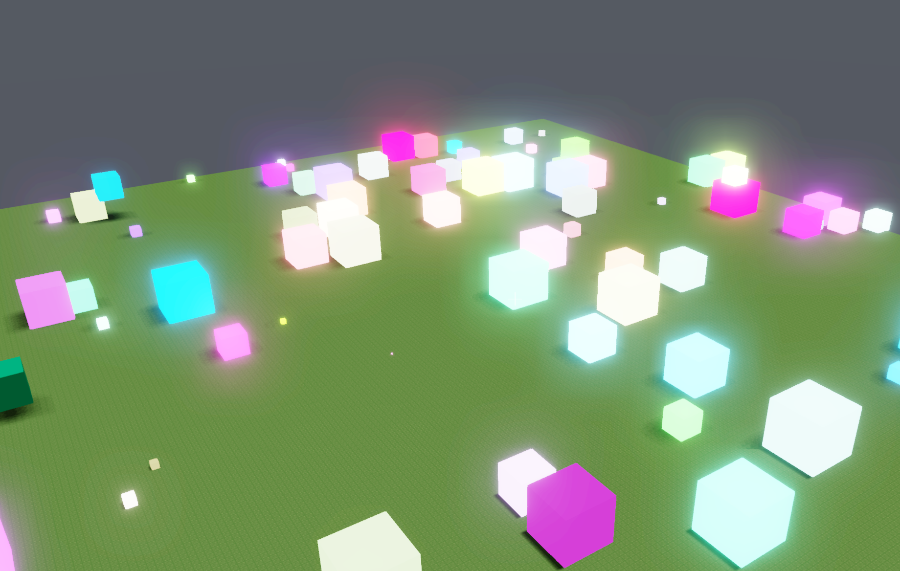

## 创建敌人

```javascript
// 设置一个随机大小，1/64为一倍大小，后面加上5/64是防止太小
const scale = Math.random() + 5 / 64;

world.createEntity({
  // 使用事先画好的白色enemy模型作为基础外观
  mesh: "mesh/enemy.vb",

  // 设置缩放
  meshScale: new Box3Vector3(scale, scale, scale),

  //随机位置，如果是128x128x128的地图，就把256改为128
  position: new Box3Vector3(
    Math.random() * 256,
    15 + Math.random() * 10,
    Math.random() * 256
  ),

  // 启用重力（物理引擎）
  gravity: true,

  // 启用碰撞
  collides: true,

  // 设置摩擦系数，否则会显得敌人被推动后太“滑”
  friction: 0.6,

  // 随机颜色
  meshColor: new Box3RGBAColor(
    Math.random(),
    Math.random(),
    Math.random(),
    255
  ),

  // 让敌人具有发光效果
  meshEmissive: 0.2,
});
```

这样就会在随机位置生成一个敌人模型



接下来试试创建 100 个敌人...

```javascript
for (let x = 0; x < 100; x++) createEnemy();
```



看起来不错，但是如果你尝试推这些敌人，它们很容易挤在一起， ~~敌人就无法群殴玩家了~~ 这不太好。
所以我们可以利用碰撞过滤，使敌人之间不能相互碰撞，于是我们需要修改一下生成敌人的代码，用<icon> entity.addTag |method parent-class</icon>给敌人实体添加标签，
然后用<icon> world.addCollisionFilter |method parent-class</icon>来添加碰撞过滤。

```javascript hl_lines="2 21-22"
const scale = Math.random() + 5 / 64;
const entity = world.createEntity({
  mesh: "mesh/enemy.vb",
  meshScale: new Box3Vector3(scale, scale, scale),
  position: new Box3Vector3(
    Math.random() * 256,
    15 + Math.random() * 10,
    Math.random() * 256
  ),
  gravity: true,
  collides: true,
  friction: 0.6,
  meshColor: new Box3RGBAColor(
    Math.random(),
    Math.random(),
    Math.random(),
    255
  ),
  meshEmissive: 0.2,
});
entity.addTag("enemy");
world.addCollisionFilter(".enemy", ".enemy");
```

再尝试推敌人，它们就不会互相推挤了
