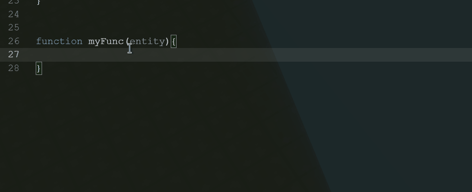

<a href="https://github.com/helloyork"></img></a>
<a href="https://github.com/alan-best"></img></a>

### 写在前面

这篇文章只是建议大家规范码字，对其他人更耐心些，其他人的对于代码的理解效率也会很快上去

当然我不会反对大家使用自己的注释模式，本文仅供参考学习，并非程序必须

> 请注意：本文为规范化开发的建议，不代表这是必须的  
> 文章仅代表个人观点，对于产生的影响概不负责
>
> 注释并非必须，他对程序编译没有影响

---

## 我们为什么要写注释？

其实在上一篇文章的课后活动中感受到了大家的批评和意见

类似于这些开发规范属于思想陈旧或没任何必要这一类的意见最多

但其实，这些都算是个人观点了，对于开发规范，为的是让项目更有可读性  
但是就连在写完一行后用小指头轻敲一下分号都难以坚持，何谈注释呢？  
（严肃声明：本文为个人观点，在回帖区基因退化为猿类概不负责）

对于这一类开发规范，很多人都是嗤之以鼻的，认为这没有必要  
但实际上，这种开发规范在神岛这种实时多人码字的环境中显得更为重要

不是所有人都能像回帖区里的大佬们对代码具有很强的理解力的  
在这种多人项目中，如果写了一个诡异句型或者难以阅读的代码，与其让其他人花半分钟甚至几分钟的时间去理解一段很小的方法  
还不如耐心的多些几个字，让别人能节省时间去写更重要的事情或更好的运用你写的方法

每个人都有属于自己的开发规范，我十分理解，但是我们的目标永远是 **更好** 和 **更强**  
所以，虽然开发规范可遵守可不遵守，也请大家不要对此嘲讽，去遵守那些在项目里有利于项目编写环境或让别人舒服的规范

**这就是对其他人和未来的自己莫大的帮助**

---

## 一个合理而优雅的注释

### 项目概述

或许大家都喜欢单开一个文件去写一大段的项目概述  
比如游戏玩法啦，需要解决的问题啦之类的

不过将一些重要的事情写在项目主代码的顶上， ~~会使代码看起来更高级(?)~~ 以及让代码需要做什么一目了然

我们的文档注释需要包括例如概要介绍、版本信息、版权声明、开源协议、修改时间等说明内容，当然非强制性

在 JavaScript 中，我们常用双斜杠来写一个注释，但是，使用`/** */`来编写注释，不仅可以多行显示，而且能够分点，更规范

例如，我们写一个简单的代码

```javascript
function sum() {
  return arguments.reduce(function (previousValue, currentIndex) {
    return previousValue + currentIndex;
  });
}
```

就是这样一个简单的代码，大家能够第一时间直到这是什么功能并且怎么用吗

相信大家都用时 0.01ms 以上才反应出来的 ~~(?因为生物电都没这么快)~~ ，而在一个项目中，往往总是一些很复杂的函数之前互相调用和嵌套

这个时候，注释就有必要出现了，通过对于一个方法的参数，返回值，作用，回调函数，类型声明等的注释

其他开发者能够在很短的时间内了解这个函数的功能，以及如何调用以及其复杂度（当然我很懒当然不会去写）

例如，在项目代码最顶端写上 TODO 标签，就能告诉代码师要做啥

```javascript
/**
 * @todo 今天咱们来访问一下瓜摊老板
 */
```

或者 FIXME 表示问题未解决

```javascript
/**
 * @fixme 瓜摊老板拒绝访问，请及时修复
 */
```

我们也能用双斜杠标记

```javascript
function(){...}
// todo: 需要编写另一个访问协议
// fixme: 瓜摊老板被戳了，协议失效

```

### 函数注释

让我们回到刚刚的代码，其意思是：将传入的所有参数执行 <icon>Array.prototype.reduce|method parent-class</icon>这个方法

这个时候，我们应该写清楚这个函数的 **接受的参数** ， **用于什么方面的** ，以及 **返回值**

这样，一个简单的代码就能告诉其他开发者：这个参数能够解决什么，怎么用

以及我们用 `@example` 标签能够举例实际代码 并且在大部分代码编辑器中高光显示

> Tips：神岛支持类型声明，举例标签高光等

让我们先看一个简单的栗子

```javascript
/**
 * @callback callback
 * @param {Array} 作用于获取到的项目 在无搜索结果的情况下返回空数组
 */
/**
 * 获取内容
 * @param {String} type 一个标识符，用于搜索项目
 * @returns {Promise|Array} 返回的数据
 * @example var values = await nomen.select('*');
 * @example nomen.select('*').then()
 */
async function select(type, callback = () => {}) {
  if (type == "*") {
    const values = await db.sql`select rowid, * from Nomen`;
    callback(values);
    return values;
  } else {
    const values = await db.sql`select rowid,
         * from Nomen WHERE type = ${type}`;
    callback(values);
    return values;
  }
}
```

这样一个比较标准的注释来源于`Nomen SQL 轻量版 for SQLite`

这个注释中，给出了 `@param` 标签，表示一个参数，然后在后面使用大括号来给出这个参数的类型  
如果是必须参数，就在 `String` 前面加上一个感叹号，如果是可选参数，就在类型前面加上一个问号

如果是多种类型可能，就用 `|` 来分隔

用@callback 来定义一个回调函数

!!! tip "注释可以提供自动补全？！"

    告诉大家一个冷知识，在神岛使用标准注释来注释函数，并且在参数类型中填写比如 `Box3Entity` ，就能在码字的时候获取实体的代码补全
    

再也不用妈妈担心自定义函数莫得代码补全的情况出现啦

> 其实其他类型也可以做到哦，比如数组，那么形参就会自带一些方法提供代码补全

### 数据类型

一个数据，如果在没有具体初始化的情况下，怎么才能得知这个数据的类型呢，换句话说，如果在码字经常遇到一个数据的类型显示“any”的情况

那么我们也可以为这个数据写注释

```javascript
/ **
 * @param {String} nomen rua!
 */
let nomen;
```

这样，当我们鼠标放到这个数据上面时，我们就可以看到自己给自己写的类型注释啦

> 文章结束，在这篇文章中，我举例了几个比较常见的标签，如果需要更多帮助请利用你的搜索引擎，搜索关于 js 代码注释的更多帮助
