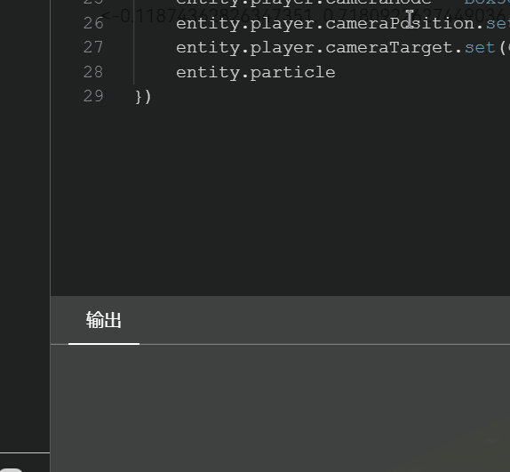
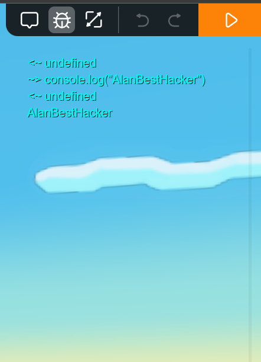

# 熟悉编辑器

??? note "本节内容"
    1. 熟悉box3的编程界面

准备好开始了吗？

!!! tip "折叠和展开部分内容"

    为了适应不同人群，教程中某些部分内容默认是折叠的（例如上面"本节内容"部分），你可以根据需要来选择跳过或者展开。
    要展开或者折叠内容，只需点击标题即可。

???+ example "熟悉编程界面"

    进入任意一个地图，点击左上角的图标，即可进入编程界面（下图，初始情况下代码编辑器中没有内容）
    

    还有一部分被隐藏了，那就是 **调试控制台**（简称控制台）。需要点击右上角的“虫子”图标打开。
    

    如果你正处在编程界面，那么调试控制台会显示在底部，拖动分割线可调整大小
    

    如果关闭了编程界面，点击调试控制台的图标后，控制台将以透明的方式展现在右侧区域（如果控制台没有内容，则显示为透明。默认情况下控制台是空的）

    

    你已经熟悉了编程界面的基本布局，这是它们各自的作用：

    - **代码编辑器**：编写代码的区域，也是最重要的区域。我们需要在这里编写代码。
    - **文件选项卡**：用来切换代码编辑器对应的文件，可以用来编辑不同代码文件中的代码。
    - **控制台（`Console`）**：程序“说话”的地方。程序的运行信息、调试内容、错误等等，都会显示在这里。同时你还可以用底部的输入框输入代码并测试结果。

了解这些以后，就可以着手开始编写第一行代码了！
就算仍然不理解也没关系，我们会在以后的教程中详细解释每一部分。

点击右下角的 **下一页** 链接即可继续。
