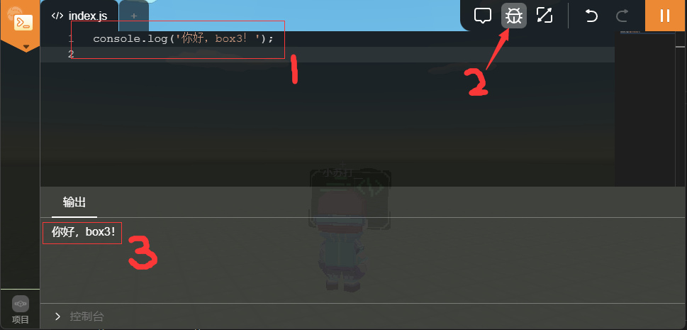
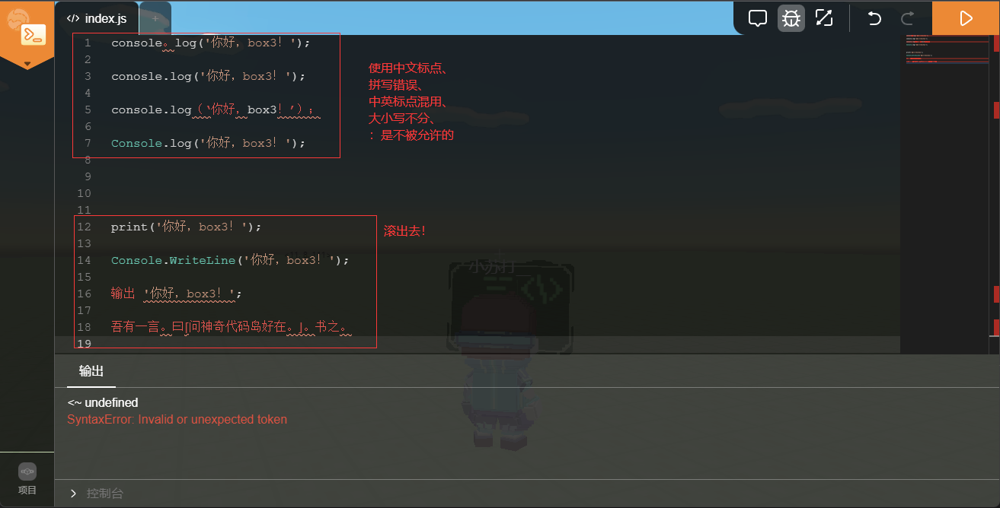

准备好编写第一行代码了吗？

??? note "本节内容"
    1. 编写第一行代码
    2. 初步了解编辑器和输出区域的作用
    3. 了解`console.log()`语句

## 我们的第一行代码
    
在岛三的编辑器里，打开代码编辑页面和控制台。（详见[熟悉编辑器](../editor.md)）


在代码编辑区输入这行代码：
```javascript
console.log('你好，box3！');
```
!!! warning "使用英文标点符号"
    **十万分小心！**

    在box3眼中，英文的`, . ! `` ' " ( ) $ _`和中文的`，。 ！ ·· “ ” （ ） ￥ —`是完全不一样的。[^1]

    因此，请使用英文标点符号。如果不放心，请关闭中文输入法。
!!! note "自己动手，丰衣足食"
    写代码和数学题一样，写多了就会有“感觉”。

    因此，我不建议直接复制代码。其一会导致一些不可预知的错误，其二可以培养你对编程的“感觉”。
按下运行按钮（将指令发送给计算机），打开控制台看看发生了什么！
??? note "应该出现的东西"
    
    如果你看到的和图片里一样，恭喜你，成功了！

    这行代码的含义是：输出一些什么在控制台。
??? note "不应该出现的东西"
    
    检查是否有单词拼写错误，或者使用中文标点。一般标红的东西是不正确的。
如果你成功了，试试更改引号里面的内容，然后重新运行，看看会出现什么！
??? example "几个例子"
    ```javascript
    console.log('你好，我是吉吉喵');
    ```
    ```javascript
    console.log('小明在考试中取得了', 100, '分！');
    ```
    ```javascript
    console.log('成绩单：', JSON.stringify({"小明": 99, "小红": 100}));
    ```
    目前不需要知道他们的含义，只需要去做，体会编程的神奇。`Just do it!`

    


[^1]: 从左到右分别为： 逗号，点号，感叹号，反引号，单引号，双引号，左括号，右括号，美元符号，下划线； 逗号，句号，感叹号，隔号，上引号，下引号，左括号，右括号，人民币符号，破折号