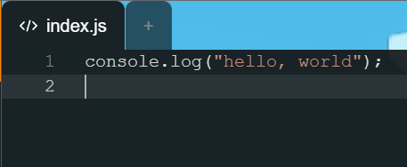
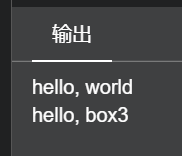
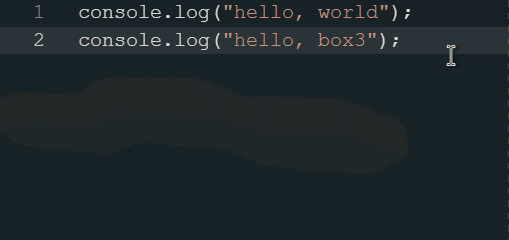

# 第一行代码 —— `hello, world`

下面让我们编写一段代码，将`hello, world`这个句子输出到控制台。

按照前面所介绍的方式，打开一个空白地图，打开编程界面。此时点击一下代码编辑器区域，你应该会看到一个光标在第一行闪动。


然后复制以下代码，并粘贴到代码编辑器中

```javascript
console.log("hello, world");
```

??? tip "在文档中快速复制代码"

    文档中所有的代码部分都具有快速复制按钮，只需要将鼠标移动到代码块右上角，点击复制图标即可。
    

粘贴代码到编辑器中，此时代码编辑器中应该是这样



然后点击右上角的运行按钮，再打开控制台，即可看到运行结果


恭喜你，你已经编写了第一个程序！

## 学以致用

上面的代码中用到了`#!javascript console.log`这一语句[^1]，它可以把后面括号中的内容输出到控制台中。

接下来我们来练习一下，尝试编写第二行代码，输出`hello, box3`。输出结果应该是这样：



请先自己尝试，然后再查看答案。注意编写代码时应该使用英文输入法，否则符号会出现错误。

??? tip "关于自动补全"

    现代代码编辑器大多都具有自动补全的功能，即只需要打出部分单词，即可补全整个单词。
    如果编辑器给出的第一个建议正是你需要的，则按下 <kbd class="key-tab">Tab</kbd> 即可快速补全，例如：

    

    需要注意的是，智能补全并不总是正确的，而且有时编辑器无法推断补全内容，也就无法提供建议。
    因此可以将智能补全当作一个提高效率的工具，但不可依赖于此。

???+ note "代码中的多个语句如何编写"

    大部分情况下，每一行代码都能表示一个独立的操作（例如发送消息、输出文本等），因此通常每行代码不会超过一个语句，例如多个`console.log`语句就应该每行一个。
    但是，每个独立的操作之间应该有一个明确的分割点，如果你是使用换行来分割不同的语句，那么`JavaScript`将会自动地在合适的地方分割。
    当然，你也可以明确地指出分割位置，只需要使用分号（英文分号`;`）即可。为了避免意外情况以及让代码更已读，建议既使用分号，又要换行。

    下面是一个没有使用分号造成意外结果的例子，如果你是初学者，不建议查看这个例子（因为有太多相对高级的概念）。你可以在学完基础教程后再回来看。
    ??? danger "忘记使用分号造成的意外结果之一：括号陷阱"
        ###### 括号陷阱
        例如计算一个算式的绝对值，通常使用函数`#!javascript Math.abs(x)`。如果算式很长，那么可以将其拆开
        ```javascript linenums="1"
        Math.abs
        (1+2-3+4-5+6-7+8-9+10-11+12-13+14-15+16-17+18-19+20)
        ```
        此时虽然第二行以括号开头，并不是完整的语句，但是由于第一行末尾没有换行，因此`JavaScript`会将第一行与第二行看成一个整体（即忽略换行）。
        这种处理方式固然可以让代码更加清晰明了，但是也会导致意外结果，例如下面这段代码
        ```javascript linenums="1"
        (function(){
            console.log("hello")
        })()

        (function(){
            console.log("world")
        })()
        ```
        看起来这段代码应该是使用两个立即执行的匿名函数，应该输出`hello`和`world`，但是实际上会报错
        !!! error ""
            ```
            TypeError: (intermediate value)(...) is not a function
            ```
        报错的原因就是这段代码中没有用分号明确标识语句的结束位置，因此`JavaScript`会忽略所有的换行，因此上面的代码等效于
        ```javascript
        (function(){console.log("hello")})()(function(){console.log("world")})()
        ```
        因此相当于在第一个函数的调用结果后加了个括号，又因为第一个函数没有返回值，所以相当于调用了`#!javascript undefined`，于是引发错误。

??? abstract "答案"

    使用`#!javascript console.log`输出指定内容
    ```javascript hl_lines="2"
    console.log("hello, world");
    console.log("hello, box3");
    ```
    <div class="result">
    ```
    hello, world
    hello, box3
    ```
    </div>

下一章节我们将学习<listener> 事件监听</listener>，并编写一个简单的程序，让世界向玩家打招呼。

[^1]: 严格来说应该叫做 <method> 方法 </method>
