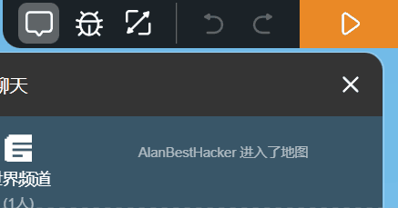

# 欢迎玩家

!!! note "本节内容"

    编写一个简单的程序，让世界向玩家打招呼。

    你将学习到：

    - 事件监听器的基本使用
    - 模板字符串
    - 世界消息广播

## 事件监听器

在此之前，我们需要先了解 **事件** 是什么。在代码岛中，程序非常“忙”。你并不能让程序完全暂停下来。因此不能让程序“等待”玩家进入时打招呼。
如果要实现这个目标，可以换一种思路。告诉程序在玩家进入地图这个 **事件** 发生的时候，应该执行什么事情。而设定的这些事情就是事件监听器。
Box3 提供了一系列 API 用于设定事件监听器。其中之一便是`world.onPlayerJoin`，意思是当玩家进入时触发。
!!! note "代码中的命名规范"

    在上面的例子中，`onPlayerJoin`是一个 **方法名** （你可以暂时理解为一种名称）。类似的名称还有`onChat`，`onVoxelContact`等等。
    这些名称并不是随意编写的，而是根据一定的规范确定的。在`JavaScript`中，^^一般名称第一个单词首字母小写，此后每一个单词的首字母都大写，单词之间不留空格。^^ [^1]

    另外，这些名称通常是表意的，我们可以根据上面提到的命名方法，将名称拆开。例如`onPlayerJoin`拆开，就是
    `on`、`player`、`join`。在与事件有关的名称中，`on`通常表示 **当...时** 的意思，`player`表示 **玩家** ，`join`表示 **加入** 。组合起来就是
     **当玩家加入时** 。

    通过类似的方法，可以理解`onChat`意为 **当聊天时** ，`onVoxelContact`意为 **当方块被接触时** 。


    [^1]: 这种命名方式被称为“小驼峰命名法”

## 事件监听器的简单使用

首先，复制这些代码并粘贴到代码编辑器中。

```javascript linenums="1"
world.onPlayerJoin(({ entity }) => {
  // 编写你的代码...
});
```

这段代码是一个基本的设置事件监听器的代码，你暂时不需要理解第 1 行和第 3 行中的符号的含义。
删掉第二行中的注释（第二行的双斜杠及其之后的内容），然后复制这行代码

```javascript
entity.player.directMessage("欢迎！");
```

??? question "动图演示"

    

运行代码，你就会收到一条内容为“欢迎！”的消息。



下面这几个练习可以帮助你更好地理解和使用事件监听器
???+ example "练习：复读机"

    ???+ note "目标"
        每当玩家发送一条消息，就让系统回复一条一模一样的消息。如图所示

        


    请编写代码完成这个目标，如果不知道从何下手，你可以看看下面两个提示。
    ??? tip "`onChat` 事件监听器"
        `onChat` 用于监听聊天消息。当聊天框中出现新的消息时，`onChat`就会被触发，其基本结构如下
        ```javascript linenums="1"
        world.onChat(({ entity, message }) => {
          // 编写你的代码...
        });
        ```
        其中，`message`代表发送的消息。


    ??? tip "`directMessage`私聊发送消息"
        使用`#!javascript entity.player.directMessage(消息内容)`即可向玩家发送消息。


    如果你成功完成了目标，那么恭喜你，你已经大致掌握了事件监听器的基本使用方法。如果你没能完成，那你可以看看下面的参考答案。
    ??? abstract "参考答案"
        !!! warning ""
            注意，答案仅供参考。如果你的解决方案比参考答案更好的话，就用你自己的更好的方法吧！
        ```javascript linenums="1"
        world.onChat(({ entity, message }) => {
            entity.player.directMessage(message); //此处message即为玩家发送的消息
        });

        ```

下面这个练习对于初学者可能有一定的难度，但是值得一试！
???+ example "练习：挖掘者"

    ???+ note "目标"
        玩家碰到的任何方块都会被破坏

        


    请编写代码完成这个目标，如果不知道从何下手，你可以看看下面两个提示。
    ??? tip "`onVoxelContact` 事件监听器"
        `onVoxelContact` 用于检测方块被触碰。当任意方块被实体（例如玩家）触碰时就会被触发，其基本结构如下
        ```javascript linenums="1"
        world.onVoxelContact(({ entity, x, y, z }) => {
          // 编写你的代码...
        });
        ```
        其中，`x`,`y`,`z`代表对应方块的坐标。


    ??? tip "`voxels.setVoxel`改变方块"
        使用`#!javascript voxels.setVoxel(x,y,z,方块名称或者ID)`即可更改指定坐标位置的方块，如果第四个参数为`#!javascript "air"`（空气）或者`#!javascript 0`，
        则会破坏指定位置的方块


    如果你成功完成了目标，那么恭喜你，你对事件监听器的基本使用方法更加了解了。如果你没能完成，那你可以看看下面的参考答案。
    ??? abstract "参考答案"
        !!! warning ""
            注意，答案仅供参考。如果你的解决方案比参考答案更好的话，就用你自己的更好的方法吧！
        ```javascript linenums="1"
        world.onVoxelContact(({ entity, x, y, z }) => {
            voxels.setVoxel(x, y, z, "air");
        });

        ```
