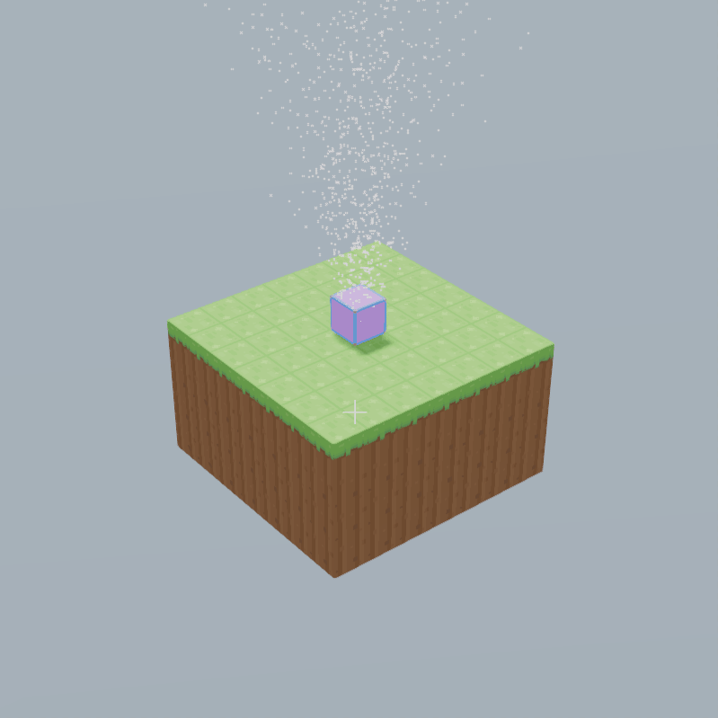

# 粒子特效

<figure markdown>


</figure>
粒子特效是一种 2D、方形的粒子。具有颜色[^1]、速度、大小等属性。由于粒子特效是 2D 的，且不需要服务器参与运算，因此可以被大量创建，
用来产生不同的视觉效果（如图）。合理利用粒子特效可以让作品更加美观、生动。

[^1]: 粒子颜色可以发光，但是用户需要启用荧光效果，否则只能显示为纯色

粒子特效必须产生于某一个实体。通过修改实体对象的属性，就可以让实体产生粒子效果。默认情况下，实体不会产生粒子。

!!! tip "'无实体' 生成粒子特效"

    粒子特效虽然需要附着在一个实体上，但是附着的实体仅影响粒子生成的范围。如果要让粒子只从特定的一点生成，则可以让粒子生成在一个体积极小的实体上；
    相反，如果要在较大范围中生成粒子，则可以让粒子生成在一个体积较大的实体上（例如海平面）

## 用编辑器制作简单的粒子特效

目前版本中，在模型属性面板可以方便地设置粒子的属性

!!! warning "不推荐使用属性面板"

    虽然使用模型属性面板设置参数时十分方便，但是目前这个功能具有许多bug，例如批量编辑多个实体时会造成属性混乱，编辑模式看到的效果与实际情况不符等。因此更推荐使用代码方式设置粒子特效。

## 用代码制作粒子特效

实体上粒子特效相关的属性都以`particle`开头。
有关粒子特效属性的详细信息，请看 API 文档中的[实体的粒子特效](../../api/entity.md)。

下面这段代码可以设置 <object>实体 entity</object> 的部分粒子特效，使其产生白烟特效。

```javascript title="白烟特效示例"
entity.particleLimit = 5000; //粒子上限为5000
entity.particleRate = 500; //例子产生速度为500
entity.particleLifetime = 3; //每个粒子的存活时间
entity.particleVelocity.set(0, 5, 0); //设置粒子速度，即向上发射
entity.particleVelocitySpread.set(3, 3, 3); //设置粒子随机速度，使其向不同方向发射
```

<div class="result" markdown>

</div>
!!! tip "关于 <property>particleVelocitySpread</property> 的随机范围"

    此属性是一个三维向量（`dx,dy,dz`），与 <property>particleVelocity</property> 配合使用。所产生的随机速度范围是 `X±dx, Y±dy, Z±dz`。

## 粒子属性过渡

粒子的大小、颜色属性可以随着时间的变化而变化。粒子的大小和颜色属性都是长度为 5 的数组，将粒子存活时间划分为 5 等份，通过设置 5 个“转折点”（关键帧）来产生平滑的过渡效果。

```javascript title="属性过渡示例"
entity.particleLimit = 5000;
entity.particleRate = 500;
entity.particleLifetime = 3;
entity.particleVelocity.set(0, 1, 0);
entity.particleVelocitySpread.set(3, 3, 3);
entity.particleSize = [10, 5, 2.5, 1, 0];
entity.particleColor = [
  new Box3RGBColor(0, 0, 0), // 黑色
  new Box3RGBColor(0.1, 0, 0), // 暗红色
  new Box3RGBColor(0.5, 0, 0), // 深红色
  new Box3RGBColor(1, 0, 0), // 红色
  new Box3RGBColor(255, 0, 0), // 亮红色（发光）
];
```

<div class="result" markdown>

</div>
对于颜色属性，若两个颜色之间进行过渡，则会显现出两种颜色的混合颜色。

```javascript title="颜色过渡混合示例" hl_lines="6-14"
entity.particleLimit = 5000;
entity.particleRate = 500;
entity.particleLifetime = 3;
entity.particleVelocity.set(0, 3, 0);
entity.particleSize = [5, 5, 5, 5, 5];
entity.particleColor = [
  new Box3RGBColor(0, 0, 0), // 黑色
  new Box3RGBColor(1, 0, 0), // 红色
  ///////////////////////////// ↓紫色
  new Box3RGBColor(0, 0, 1), // 蓝色
  ///////////////////////////// ↓青色
  new Box3RGBColor(0, 1, 0), // 绿色
  new Box3RGBColor(1, 1, 1), // 白色
];
```

<div class="result" markdown>

</div>

!!! bug "数量上限 属性并不完全起作用"

    虽然将数量上限设置为0时不会产生粒子，但是设置为任何大于零的数，粒子都可以不断产生[^2]，且将 <property>particleLimit</property> 修改改为0会停止粒子的生成，已生成的粒子不会被删除。

[^2]: 直到超过渲染最大值时，最先产生的粒子会被强制删除。这里的“最大值”是一个不可见的画质设定，默认值为`65536`。
