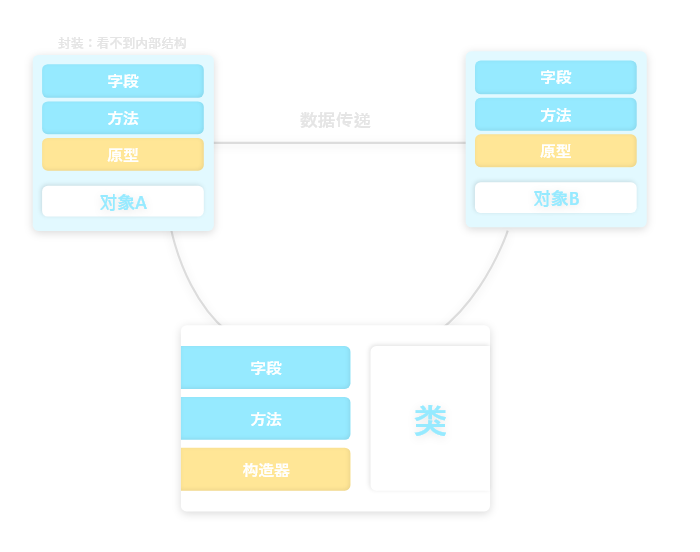
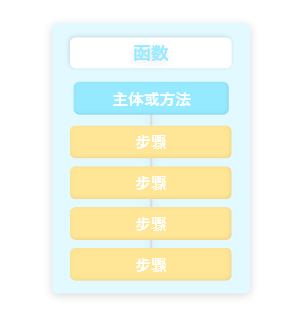

  

## [Nomen JS教程系列]

# [一文带你真正了解-SQLite基础]

**系列** - 一文带你真正了解
1. 一文带你真正了解-神奇代码岛API - shequ.codemao.cn/community/491063
     
2. [**精**] 神岛首次实现A*寻路 - shequ.codemao.cn/community/491082
     
3. [**精**] 一文带你真正了解-Function - shequ.codemao.cn/community/491227
     
4. [**精**] 一文带你真正了解-面对对象 - shequ.codemao.cn/community/491383
     
5. 一文带你真正了解-A-Star3D寻路 - shequ.codemao.cn/community/492878
     
6. 一文带你真正了解-SQLite基础 [**本章**]
      

---

## 目录

1. 写在前面
2. 什么是面对对象
   1. 面对对象与面对过程的区别
   2. 面对对象优缺点
3. [**重点**] 面对对象基础
   1. 封装
   2. 继承与多态
4. [**扩展**] 面对对象开发原则
   1. 单一职责原则
   2. 开闭原则
   3. 里氏替换原则
   4. 依赖倒转原则
   5. 接口隔离原则
   6. 迪米特法则
5. JavScript示例代码

---

## 正文 - 一文带你真正了解-SQLite基础

### 写在前面

我前五次发的教程帖已经沉了  
这令我难以理解，社区里随便挑起一个大佬发的水贴就能有20~200不等的评论，上千上万的浏览量

不过我还是要祝贺这一个系列成功完结，这是我发的第一个教材贴系列，还是有很多同学愿意在回帖区留下自己的足迹  
这给了我不少写下去的动力

我真的输了吗？没有，只要有一个人在看，我都会做下去  
感谢你们的每一个顶贴

---

## 什么是SQL

 

### PO与OO的区别

- **面向过程（Procedure Oriented）**

顾名思义，程序侧重于过程，即**做什么**，例如函数

程序将任务分解为一段一段的过程，然后用函数以及方法完成

例如，如果需要买个瓜，首先函数会执行`骑上电动车`，然后执行`前往瓜摊`，然后执行`议价`

作者画画技术不高，能看就行

 

- **面向对象（Object Oriented）**

程序侧重对象，即**谁来做**，将任务抽象为对象，使用对象来完成任务

例如，如果需要买个瓜，抽象一个名字叫`华强`的类，执行方法`买瓜`

 

### 面对对象优缺点

- **优点**

> 1、易维护  
> 采用面向对象思想设计的结构，可读性高，由于继承的存在，即使改变需求，那么维护也只是在局部模块，所以维护起来是非常方便和较低成本的。
>
> 2、质量高  
> 在设计时，可重用现有的，在以前的项目的领域中已被测试过的类使系统满足业务需求并具有较高的质量。
>
> 3、效率高  
> 在软件开发时，根据设计的需要对现实世界的事物进行抽象，产生类。使用这样的方法解决问题，接近于日常生活和自然的思考方式，势必提高软件开发的效率和质量。
>
> 4、易扩展  
> 由于继承、封装、多态的特性，自然设计出高内聚、低耦合的系统结构，使得系统更灵活、更容易扩展，而且成本较低。
>
> —— 来自“轻松”的博客 - cnblogs.com/sun_moon_earth/archive/2008/07/21/1247512.html

那么可以得知，面对对象的优点是利于灵活开发以及利于维护，这对于一些大型代码是很有帮助的

 

- **缺点**

世界上没有完美的东西，面对对象的缺点也显而易见

首先是性能，在JavaScript中，面对对象一般都会被抽象为一个类，但实际上类是十分消耗性能的，如果在代码中重复使用大量的类，将一些没有太多必要或不符合原则
的内容封装，这对性能来说是一次打击

其次，面对对象对于最终的目标会很模糊，面对对象主要是强调谁来解决问题，而不是去达到目标（面对过程），

所以，对于是否使用面对对象还是面对的过程，我们都应该谨慎思考，对于特性要明白变通

  

## 面对对象基础

### 封装

>
在面向对象编程方法中，封装（英语：Encapsulation）是指，一种将抽象性函数接口的实现细节部分包装、隐藏起来的方法。同时，它也是一种防止外界调用端，去访问对象内部实现细节的手段，这个手段是由编程语言本身来提供的。封装被视为是面向对象的四项原则之一
>
> ——来自维基百科 - zh.m.wikipedia.org/zh-my/封裝_(物件導向程式設計)

如何理解上面一句话？只需要看懂一句话：封装是将抽象函数接口的实现部分包装隐藏起来，防止访问内部细节

也就是说，一个封装好的接口，能够访问对象提供的方法以及属性，而不会去访问其内部内容，防止被其他的程序污染或篡改

这也能让外部调用者了解，哪一些是可以向外提供的方法，哪一些是不能被读取的内容，只要接口不变，那么代码的内容就不会被篡改

### 继承与多态

其实我认为一个观点很好，继承与多态实际上是连一起讲的，继承带有**改变**与**扩展**两种形态，那么都有两种形态了，这个多态就自然而然出现了

先说继承，其有两种含义，第一是继承基类的方法，并且改变与扩展代码

其次是声明某个子类是否兼容于其父类，也就是被继承者是否完全对接其父项，外部调用者可以据此做出改变或兼容

多态，根据类的不同，做出相应改变，而继承中改变或扩展之后则是由多态实现

所以，多态实际上是继承的具体细节，故无分裂概念一说

举个栗子：

一个有正常计算机基础的人是能使用键盘的（无特殊前提）  
那么现在我们有一个类是用于构建一个人的，而构建后的这个对象拥有打字这个能力（方法）
假设一堆人里面有一个代码师和建造师，那么这两种角色都是人，都能打字，
也就是说，他们能使用键盘，继承了一个正常人都有的能力（方法），但是有不同的职业  
这个时候呢，一个代码师的键盘习惯肯定是asdfhjkl，而建筑师的键盘习惯是asdw，那么这就实现了多态  
能够根据类的不同做出一定的改变，这很好理解吧

这个时候，所有职业都有一个能力就是做地图，然后所有人都有一个字段那就是贡献数量  
贡献地图的数量是不能随意改变的，不能被外部调用者随意篡改，那么我们就将这个字段保护起来，不允许非成员访问  
然后我们再定义一个方法：做地图，调用这个方法能增加贡献数量，但是会收到这个方法的限制  
这就算是封装

  

##  [扩展知识] 面对对象开发原则

在本章中，考虑到萌新存在概念混乱的问题，所以我们只讲主要的六种原则，可以当作扩展知识来阅读，非必读项目

一下内容节选自来自`Yorek's Blog 的博客 - blog.yorek.xyz/design-pattern/design-principle/#3`

> - 单一职责原则  
>一职责原则(Single Responsibility Principle, SRP)：每个模块或类都应该对软件提供的功能的一部分负责，而这个责任应该完全由类来封装。它的所有服务都应严格遵守这一职责
>
> 
> - 开闭原则  
> 开闭原则(Open Close Principle, OCP)：软件中的对象(类、模块、函数等)对扩展是开放的，对修改是封闭的。 当然，这只是理想化的愿景，在实际开发中，修改原有代码、扩展代码往往是同时存在的。 已存在的实现类对于修改是封闭的，新的实现类可以通过覆写父类的接口应对变化。
> 
> 
> - 里氏替换原则  
> 里氏替换原则(Liskov Substitution Principle, LSP)：所有使用基类的地方必须能透明地使用其子类的对象
> 
> 
> - 依赖倒转原则  
> 依赖倒转原则(Dependence Inversion Principle, DIP)：是指一种特定的解耦（传统的依赖关系建立在高层次上，而具体的策略设置则应用在低层次的模块上）形式，使得高层次的模块不依赖于低层次的模块的实现细节，依赖关系被颠倒（反转），从而使得低层次模块依赖于高层次模块的需求抽象
>   1. 高层次的模块不应该依赖于低层次的模块，两者都应该依赖于抽象接口。 
>   2. 抽象接口不应该依赖于具体实现。而具体实现则应该依赖于抽象接口。
> 
> 
> - 接口隔离原则  
> 接口隔离原则(Interface Segregation Principle, ISP)：客户端不应该依赖它不需要的接口。
> 
>
> - 迪米特法则
> 迪米特法则(Law of Demeter, LoD), 最少知识原则(Principle of Least Knowledge)： 
>   1. 每个对象应该对其他对象尽可能最少的知道 
>   2. 每个对象应该仅和其朋友通信；不和陌生人通信 3. 仅仅和直接朋友通信
> 
> ——来自Yorek's Blog 的博客 - blog.yorek.xyz/design-pattern/design-principle/#3
  

## JS面对对象

>在许多其他语言中，类或构造函数与对象或实例明显区分开来。在JavaScript中，类主要是对现有原型继承机制的抽象 - 所有模式都可以转换为基于原型的继承。类本身也是普通的 JavaScript 值，并且有自己的原型链。事实上，大多数普通的JavaScript函数都可以用作构造函数 - 您将new运算符与构造函数一起使用来创建新对象。
> 
> ——译自MDN社区

 

我们能通过`class MyClass {
// class body...
}`来定义一个类

以及`constructor()`来定义构造函数

有关Class的教程详见网络教程，此处不多赘述

对象拥有字段与方法，以及能够继承一些属性

我们能够使用new关键字构造一个对象，但是类不会再代码中提升，在类声明之前操作会导致编译拒绝

---

### 文章结束

> 本文参考文献：
> - Object-oriented programming - developer.mozilla.org/en-US/docs/Learn/JavaScript/Objects/Object-oriented_programming
> - JavaScript 对象基础 - developer.mozilla.org/zh-CN/docs/Learn/JavaScript/Objects/Basics
> - 一篇文章搞定“JavaScript面向对象” - segmentfault.com/a/1190000039968894
> - What Is OOP In JavaScript And How Is It Implemented? -
    simplilearn.com/tutorials/javascript-tutorial/oop-in-javascript#oop_concepts_in_javascript
> - 2分钟让你明白什么是面向对象编程 - zhuanlan.zhihu.com/p/75265007?utm_id=0
> - 面向对象编程的弊端是什么？ - zhihu.com/question/20275578
> - JS设计模式之原型模式（创建型） - cnblogs.com/Leophen/p/14823184.html
> - 面向对象的好处 - cnblogs.com/sun_moon_earth/archive/2008/07/21/1247512.html
> - 面向对象编程的弊端是什么？ - blog.csdn.net/yemat/article/details/106889710
> - 【面向对象特征系列之“多态”】 - zhuanlan.zhihu.com/p/37655397
> - 这样理解面向对象的封装，继承，多态是否正确？ - zhihu.com/question/52767718
> - 面向对象编程的弊端是什么？ - zhihu.com/question/20275578
> - 如此理解面向对象编程 - coolshell.cn/articles/8745.html
> - 维基百科 - zh.m.wikipedia.org/zh-my/封裝_(物件導向程式設計)
> - 【面向对象特征系列之“封装”】 - hyktech.gitee.io/javatech/2017/08/16/封装/#more
> - 面向对象的六大原则 - blog.yorek.xyz/design-pattern/design-principle/
